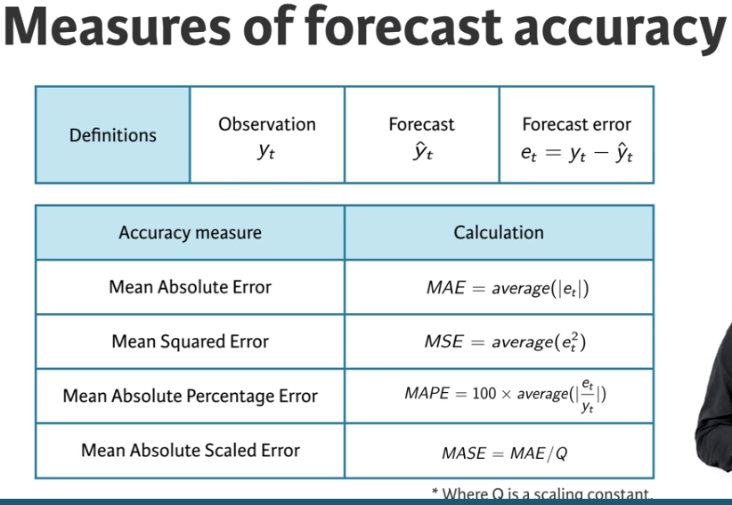
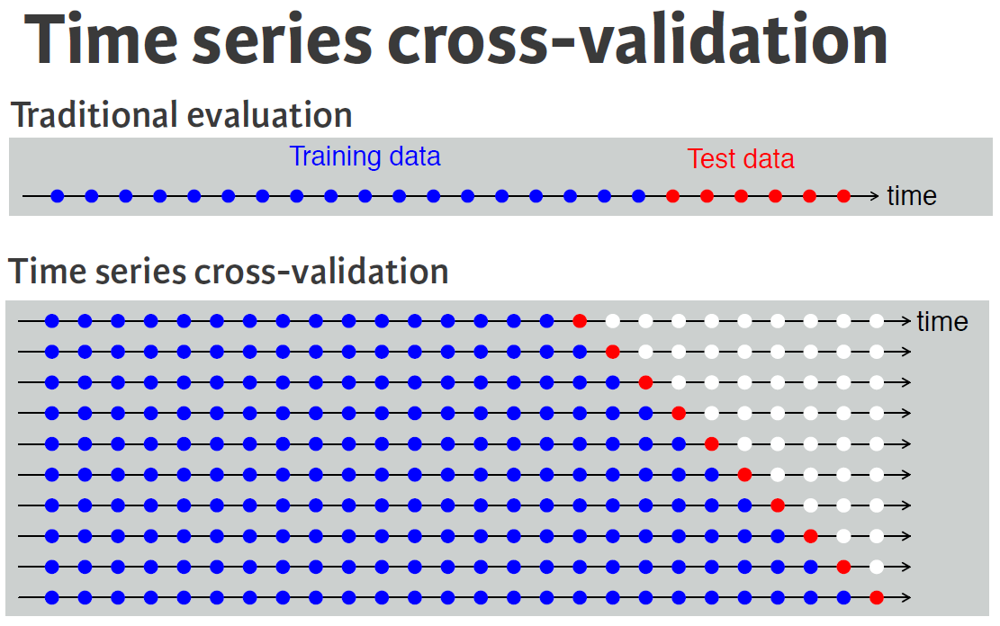

```{r}
library(fpp2, quietly = T)
```

# Exploring and visualizing time series in R

## Frequency and outliers

which.max(), can be used to identify the smallest index of the maximum value. and frequency(), used to find observations per unit time. 

## Autocorrelation of seasonal and cyclic time series

Also use function gglagplot().

```{r}
# Plot the annual sunspot numbers
autoplot(sunspot.year)
ggAcf(sunspot.year)

# Save the lag corresponding to maximum autocorrelation
maxlag_sunspot <- 1

# Plot the traffic on the Hyndsight blog
autoplot(hyndsight)
ggAcf(hyndsight)

# Save the lag corresponding to maximum autocorrelation
maxlag_hyndsight <- 7
```

## Ljung-Box test

Test all the autocorrelations together rather than consider each one separetly, so we use Ljung-Box test. It considers the first h autocrrelation values together. 

A significant test (small p-value) indicates the data are probably not white noise. 

It is very useful in order to detect if the data is white noise, a time series that is purely random. 

As you learned in the video, white noise is a term that describes purely random data. You can conduct a Ljung-Box test using the function below to confirm the randomness of a series; a p-value greater than 0.05 suggests that the data are not significantly different from white noise. Example:

```{r eval = FALSE}
googwn <- Box.test(diff(goog), lag = 25, type = "Ljung-Box")
```

# Forecast for potential futures

## Naive and snaive

```{r eval=FALSE}
# Use naive() to forecast the goog series
fcgoog <- naive(goog, h = 20)

# Plot and summarize the forecasts
autoplot(fcgoog)
summary(fcgoog)

# Use snaive() to forecast the ausbeer series
fcbeer <- snaive(ausbeer, h = 16)

# Plot and summarize the forecasts
autoplot(fcbeer)
summary(fcbeer)
```

## Fitted values and residuals

A *fitted value* is the forecast of an observation using all previous observations

* That is, they are one-step forecasts
* Often not true forecasts since parameters are estimated on all data

A *residual* is the difference between an observation and its fitted value

* That is, they are one-step forecast errors

If our forecasting method is good, the residuals should look like white noise

Essential assumptions:

* They should be uncorrelated
* They should have mean zero

Useful properties (for computing prediction intervals)

* They should have constant variance
* They should be normally distributed

We can test these assumptions using the `checkresiduals()` function.

When applying a forecasting method, it is important to always check that the residuals are well-behaved (i.e., no outliers or patterns) and resemble white noise. The prediction intervals are computed assuming that the residuals are also normally distributed. You can use the `checkresiduals()` function to verify these characteristics; it will give the results of a Ljung-Box test.

## Training and test sets

The test set must nos be used for any aspect of calculating forecasts. We will use the training set to do that. A model which fits the trining data well will not necessarily forecast well. Can ve overfitted. 

### Forecast errors

$e_t = y_t - \hat{y}_t$ is the difference between observed value and its forecast in the test set. 

There resuduals in the training set are not the same than in the testing set:

* which are errors on the training set (vs. test set)
* which are based on one-step forecasts (vs. multi_step)

Compute accuracy using forecast errors on test data.



Important information to know about these metrics:

If you want to compare between series in very different scales, you can not compare MAE or MSE because this size depends on the scale of the data 

The MAPE is better to do comparisons, but only if the data is all positive or if it has no 0 values or small values.It also assumes that there is a natural 0, so can not be used for temperature forecast.

A solution is the MASE, it's like MAE but scaled so can be compared across series. 

In all cases a small value indicates a better forecast.

We can use the `accuracy()`calculates all these metrics for us. 

## Evaluating forecast accuracy of non-seasonal methods

In data science, a training set is a data set that is used to discover possible relationships. A test set is a data set that is used to verify the strength of these potential relationships. When you separate a data set into these parts, you generally allocate more of the data for training, and less for testing.

One function that can be used to create training and test sets is `subset.ts()`, which returns a subset of a time series where the optional `start` and `end` arguments are specified using index values.

## Evaluating forecast accuracy of seasonal methods

As you learned in the first chapter, the `window()` function specifies the `start` and `end` of a time series using the relevant times rather than the index values. Either of those two arguments can be formatted as a vector like `c(year, period)` which you have also previously used as an argument for `ts()`.

## Time series cross-validation



The tsCV() function computes time series cross-validation errors. It requires you to specify the time series, the forecast method, and the forecast horizon. 

When we use the function `tsCV` we need to create out own error measures, like the following one to get the MSE: 

```{r}
e <- tsCV (oil, forecastfunction = naive, h = 1)
mean(e^2 , na.rm = TRUE)
```

Computing the mean square error for different tsCV functions, you can see that it increases with the forecast horizon: 

```{r}
sq <- function(u){u^2}
for(h in 1:10){
  oil %>% tsCV(forecastfunction = naive, h = h) %>%
    sq() %>% mean(na.rm = TRUE) %>% print()
}
```

In summary, `tsCV()`is a good tool from selecting a good forecasting model. In general, the best option is to choose the model with the smallest MSE, so compute it at the forecast horizon of most interest to you. 
